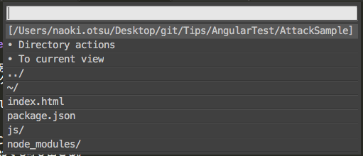
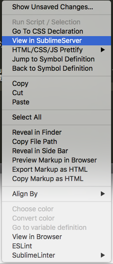

# SublimeTextで便利と思ったTips
※SublimeText3を使用

## 開いているファイルの階層や親子階層でFinder操作がしたい
Sublime Filesを入れると、Finderやコマンドを打たずともSublimeだけで  
別ファイルを開いたり、新規ファイル作ったり、ディレクトリを作ったりが出来るようになる。  

**どうやって**   
install packageでSublime Filesを入れて、Ctrl+Command+Nキーを押すとポップアップが表示される。  
もしくは、command+shift+pからsublime filesでも呼び出せる。  
後はポップアップの項目を選択することで操作出来る。  


## 開いているファイルをブラウザで確認したい
**どうやって**   
install packageでView in Browserを入れて、  
該当ファイル上で右クリック、「View in Brower」を選択すると見れるようになる。  
ただ初期状態は、Firefoxが開くようでChromeにしたかったので、  
［Preferences］－［Package Settings］－［View In Browser］－［Settings - User］を下記に変更しChromeで開くようにした。  
```
{
	"browser": "chrome"
}
```

ただ、場合によってはローカルサーバーを立てて見たい時もある。  
そんな時は、SublimeServerを入れると、Gulpなど使わずにローカルサーバーを立てて見られる。  

install packageからSublimeServerを入れる。  
ファイル上から、「Tools」- 「SublimeServer」- 「Start SublimeServer」をするとサーバーがStartする。  
あとは、右クリックから「View in SublimeServer」を選択するとブラウザが開く。  


## マークアップを効率よく
**こんな時に便利**  
・マウス、矢印操作を出来るだけせずにマークアップしたい

**どうやって**   
HTMLやCSSファイルで、Command + Shift + 「る」キー を押すと、  
次の要素を選択してくれる。慣れるとマウスやキーボードの矢印操作で動かすより効率が良くなる。  
前の要素を選択するには、Command + Shift + 「ね」キー を押すと良い。  


